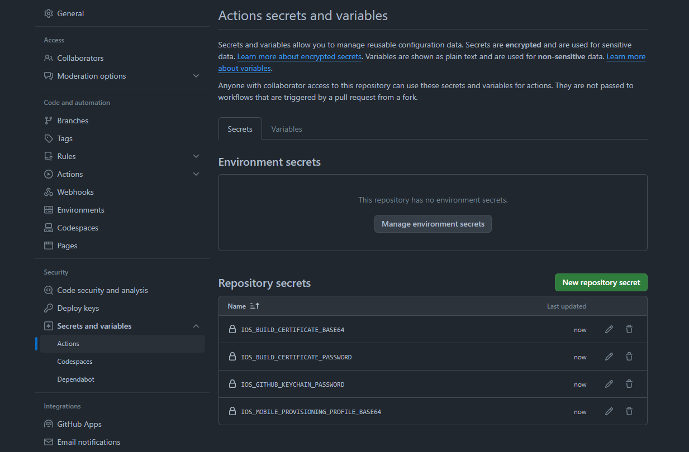

Setups the macos environment to be able to build a flutter app targetting ios. 

This requires some steps in order for this action to be successful:

# See also

  - [flutter build android](https://github.com/cedvdb/action-flutter-build-android)
  - [flutter build web](https://github.com/cedvdb/action-flutter-build-web)


# 1. Gather the certificate and provisioning profile

You'll need:
  
  - the p12 ditribution certificate
  - the password for the p12 certificate
  - the provisioning profile (most likely distribution or ad_hoc)

[Here is how to get those](https://ioscodesigning.io/exporting-code-signing-files)


# 2. Add secrets values in your repository settings

Base64 encode the certificate and provisioning profiles

```
base64 -i BUILD_CERTIFICATE.p12 | pbcopy
```

and 

```
base64 -i PROVISIONING_PROFILE.mobileprovision | pbcopy
```

and add those values to your github repository secrets. The keychain password can be any random string.



 - IOS_BUILD_CERTIFICATE_BASE64 : This is the base64 version of your certificate.p12
 - IOS_BUILD_CERTIFICATE_PASSWORD : This is the password for certificate.p12
 - IOS_GITHUB_KEYCHAIN_PASSWORD : A random string of your choosing
 - IOS_MOBILE_PROVISIONING_PROFILE_BASE64 : The base64 version of your.mobileprovision file

# 3. Build locally

Follow this step closely:

1. In Xcode, automatic signing should be checked for a new flutter project. Build your project once with this enabled.
2. Once your app has been built locally, you should have a `ExportOptions.plist` file created in the build directory `build/ios/ipa/ExportOptions.plist`. 
3. Copy the content of `ExportOptions.plist` and add it to a new `GithubActionsExportOptions.plist` file in the ios directory. This will be used by the action to sign the app.
4. Change the signingStyle to manual and add your provisional profile into `GithubActionsExportOptions.plist`. You should have this:

```
<key>signingStyle</key>
<string>manual</string>
<key>provisioningProfiles</key>
<dict>
  <key>com.myapp.app.dev</key>
  <string>{{ YOUR PROFIL NAME }}</string>
</dict>
```

You can find the profile name in the [developer account profile list](https://developer.apple.com/account/resources/profiles/list)

5. In Xcode, untick the Automatic signing checkbox for the release build and choose your profile (the same as above). Keep the signing manual for release builds.

6. You should now be able to build the project locally the same way it will be built in the action, verify that it is the case:

```
flutter build ipa --release --export-options-plist ios/GithubActionsExportOptions.plist
```


# 4. Usage


```yaml
name: Build and distribute

on:
  push:
    branches:
      - main

jobs:
  build:
    name: build
    runs-on: macos-latest
    steps:
      - uses: actions/checkout@v2

      - uses: cedvdb/action-flutter-build-ios@v1
        with:
          # always use --export-options-plist=ios/GithubActionsExportOptions.plist
          build-cmd: flutter build ipa --release --flavor dev --export-options-plist=ios/GithubActionsExportOptions.plist
          certificate-base64: ${{ secrets.IOS_BUILD_CERTIFICATE_BASE64 }}
          certificate-password: ${{ secrets.IOS_BUILD_CERTIFICATE_PASSWORD }}
          provisioning-profile-base64: ${{ secrets.IOS_MOBILE_PROVISIONING_PROFILE_BASE64 }}
          keychain-password: ${{ secrets.IOS_GITHUB_KEYCHAIN_PASSWORD }}

      - name: Archive IPA
        uses: actions/upload-artifact@v2
        with:
          name: release-ipa
          # Try running the build locally with the build command to be sure of this path
          path: build/ios/ipa/App-dev.ipa
```

Note: when using the build-cmd, use the `--export-options-plist=ios/GithubActionsExportOptions.plist` argument, so it uses the export option created in step #3.
