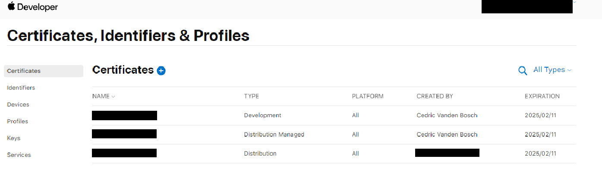

Setups the macos environment to be able to build a flutter app targetting ios

# 1. Gather the certificate and provisioning profile

#### Get the certificates and provisioning profile
You'll need:
  
  - the p12 certificate
  - the password for the p12 certificate
  - the provisioning profile

If you do not have a distribution certificate yet: one way to obtain one is to create one via [apple developer account](https://developer.apple.com/account/resources/certificates/list)

Then in xcode, open xcode > settings > accounts [TODO]




Then you can do the same for your provisioning on the [apple developer account profile page](https://developer.apple.com/account/resources/profiles/list)


# 2. Add secrets values in your repository settings

Base64 encode the certificate and provisioning profiles

```
base64 -i BUILD_CERTIFICATE.p12 | pbcopy
```

and 

```
base64 -i PROVISIONING_PROFILE.mobileprovision | pbcopy
```

and add the values to your github repository secrets. The keychain password can be any random string.

